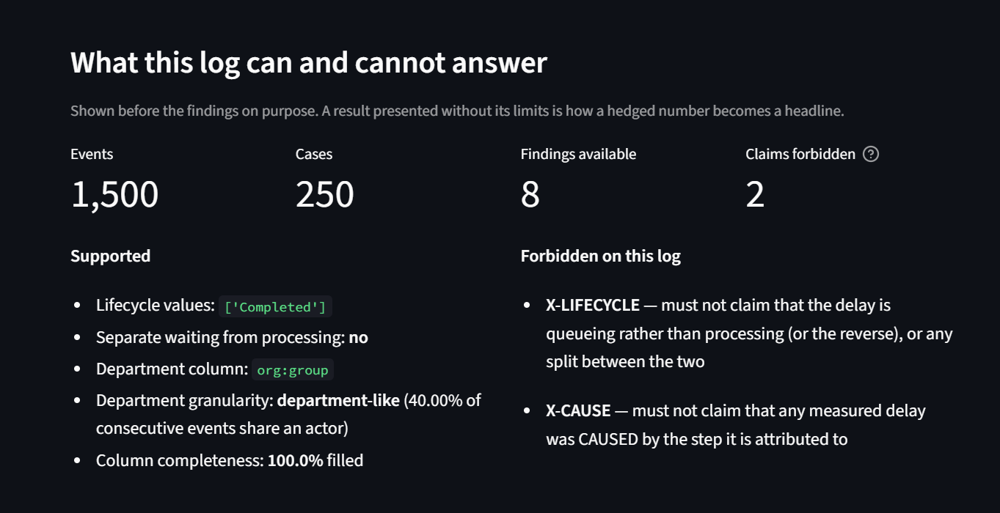
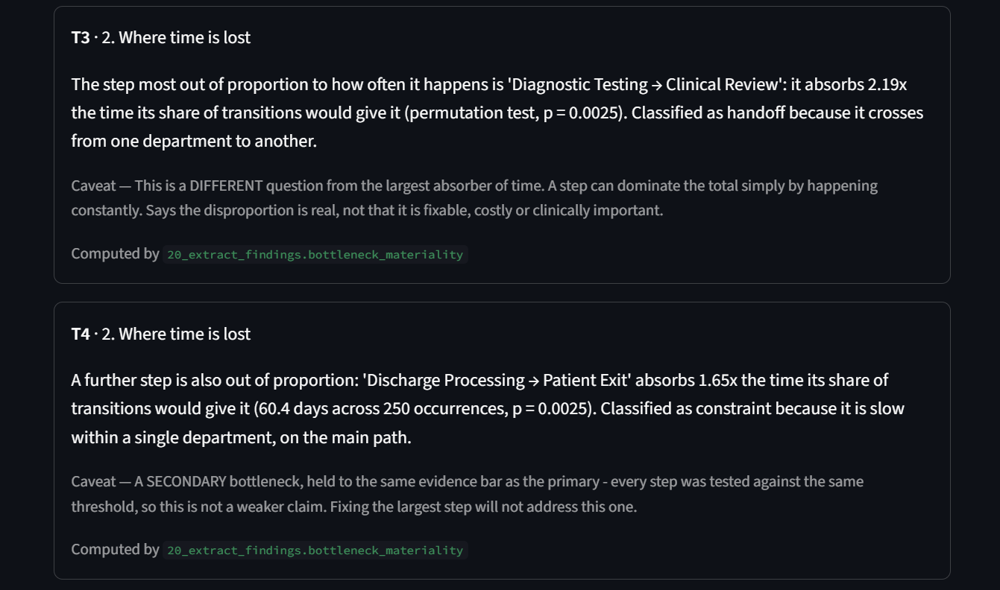

# Hospital Process Bottleneck Detective

**Upload a hospital event log. Get findings, probable causes and recommendations —
where every number is computed by code, and the AI layer is mechanically prevented
from inventing any of its own.**

```bash
conda activate hospital
python -m streamlit run src/24_app.py
```

Drop in a CSV of process events. The tool maps your column names, works out what
that log can and cannot support, finds where time is lost, and — optionally — has
a language model interpret the findings. Anything the model says that isn't
traceable to a computed number is rejected and never written.

If you do not have a log to hand,
[`docs/sample_hospital_log.csv`](docs/sample_hospital_log.csv) is 1,500 events of
a synthetic patient pathway. Its columns are named nothing like the XES standard
(`Case_ID`, `Step_Name`, `Unit`), so it exercises the column mapping as well as
the analysis, and it contains two bottlenecks rather than one.



*The capability gate is shown **before** any finding. The tool states what this
particular log cannot support, and those become prohibitions enforced on the AI
layer's output.*

---

## The problem

Hospitals produce event logs as a by-product of operating. Those logs record when
things happened, so they contain the answer to *where is time being lost* — but
getting it out has two failure modes:

**A BI dashboard** reports average wait per activity. That averages away the thing
that matters: delay is **path-dependent**. In the log analysed here, the biggest
single absorber of time has a **median of zero minutes** — it dominates through
sheer frequency, and a bar chart of averages ranks it nowhere.

**A language model** handed the raw log will answer fluently and cannot be trusted
on the arithmetic. Nothing stops it inventing the number it needs, and a fabricated
figure reads exactly like a real one.

This project separates the two jobs:

```
event log  →  process mining        computes every number
           →  evidence extractor    states findings + what this log CANNOT support
           →  language model        interprets, hypothesises, recommends
           →  guard                 verifies the model introduced nothing
```

The contribution isn't the process mining, which is standard. It's the
**verification layer**.

---

## What makes it different

**The system derives its own prohibitions.** Before analysing, it profiles the log
and works out what that log can support. Missing capabilities become *forbidden
claims* enforced on the model's output:

| Log | Findings offered | Claims forbidden |
|---|---|---|
| Sepsis (Dutch hospital, 15,214 events) | 8 | **2** — no start timestamps, no causation |
| Hospital Billing (451,359 events) | 7 | **4** — the above, plus person-level resource column and 44.8% missing data |
| A log with no department column | 6 | **3** — the above, plus anything about *who* is responsible |

Nothing in the code knows which log it is reading. The prohibitions come from the
data's own properties.

**It refuses to write output that fails verification, and that is not a claim to
take on trust.** Pointed at a log it had never seen, a model tried to claim the
time split between departments, on a column that identifies 1,150 individuals
rather than departments, which makes the split meaningless. The output was
rejected and nothing was written. That run is preserved verbatim in
[`outputs/21_holdout_rejected_run.log`](outputs/21_holdout_rejected_run.log).

Nobody wrote "do not let it say this about that log". The prohibition was derived
from the column's own properties, and the guard enforced it.

Rejections also catch invented numbers: a model proposing a service-level target
that appears nowhere in the evidence is rejected on the number alone. Run
`python src/21_diagnose.py --self-test` to see all seven checks exercised.

**It can say "nothing stands out here."** A permutation test asks whether any step
absorbs more time than its share of transitions would give it. On healthy
processes, nothing does, and the system says so instead of naming a bottleneck
because one always ranks first.

**It reports every bottleneck, not just the worst one.** Each step is tested
against the same threshold — the Westfall–Young max-T procedure, so the
family-wise error rate is the 0.05 a single-step test already carried. On a log
with two planted bottlenecks it finds both; on one with a single defect it reports
exactly one.



*Two bottlenecks, each with a permutation-test p-value, a signature classified
from the numbers (`handoff` vs `constraint`), its caveat, and the function that
computed it. The secondary is held to the same evidence bar as the primary.*

---

## Validation

Three independent checks, answering three different questions. None substitutes
for the others.

### 1. Does the arithmetic match published research?

Reproduces specific figures from Mannhardt & Blinde (2017) on the same dataset:

| Claim | Published | Computed |
|---|---|---|
| Antibiotics 1-hour rule violated | 58.5% | **58.44%** |
| Mean days until patient return | 81.6 | **81.0** |
| Distinct trace variants | 845 | **846** |
| Trace uniqueness | 80% | **80.57%** |

Six further figures did **not** reproduce. They are reported as failures and
traced to cohort definition rather than smoothed away. Run
`python src/04_validate_literature.py` to regenerate the full comparison
table in seconds.

### 2. Does it work on a hospital it has never seen?

A second log — 451,359 events, 100,000 cases, a different hospital and a different
process — was held out entirely until the generalisation work, then run once.

**18/18 checks pass**, including the sharpest one: *no activity name from the
training log appears in any artifact built from the holdout.* That assertion failed
three times before passing, each time catching a different hard-coded remnant.

It also exposed a genuine defect: the pipeline reported **100% of waiting as
"handoff"** and nothing warned. The cause was that the two logs' resource columns
mean different things — 26 departments versus 1,150 individuals. The system now
measures that and withholds the statistic instead of printing it.

### 3. Are the answers actually correct?

There's no ground truth for a real hospital, so it was manufactured: **27
randomised process structures**, each with one defect injected and hidden, pipeline
run unchanged.

| Metric | Result |
|---|---|
| Defects located by the analysis | **24/24 (100%)** |
| Correct at every effect size tested, down to 0.5× background | **yes** |
| AI diagnoses passing verification | 19/27 — **8 abstentions** |
| Accepted diagnoses naming the real defect | **19/19** |
| False positives on healthy control processes | **0/3** |

Deceptive cases were verified to actually deceive — including one where the real
defect ranks **10th** by a naive `median × count` metric and **1st** by total time.

---

## What it deliberately refuses to do

Each of these is enforced in code, not noted in prose:

- **Separate queueing from processing** on a log without start timestamps. The
  Sepsis log records only `complete` events, so the claim is forbidden.
- **Attribute delay to a department** when the resource column names individuals,
  or when 45% of it is empty.
- **Assert a cause.** An event log records when things happened, not why. The
  diagnosis schema has no field for a cause — only hypotheses, each of which must
  carry a way to test it.
- **Present a rupee figure as a hospital's own loss.** The business case values
  simulated bed-hours against a published external benchmark; phrasing it as actual
  money lost is permanently blocked.

### The known limit

The guard verifies that every number came from the evidence. It does **not** verify
the number is attached to the right thing. A model once bound a real figure
describing *five* steps to a *single* transition — every component genuine, the
combination false. Numbers are checked against a set and phrases against patterns;
neither examines the binding between them.

**The system guarantees provenance, not inference.** Catching the rest needs
semantic parsing, not string matching.

---

## Results from the analysed data

Working from a Dutch hospital's sepsis pathway (15,214 events, 1,050 patients) plus
a calibrated simulation of an Indian insurance-discharge process:

- **Two different questions, two different answers.** The largest absorber of time
  (`CRP → Leucocytes`) has a median of **0 minutes** — it dominates by frequency.
  The step genuinely out of proportion to how often it occurs is
  `Admission NC → Release A` at **7.4×** its share of transitions (p = 0.0025) —
  the ward-to-discharge handover. These imply different fixes.
- **45% of waiting is internal** to a department; **55%** is between departments.
  An activity-level ranking cannot tell those apart.
- **Insurance-backed discharge is slower at every parameter value tested.** Even
  assuming a perfect insurer with zero document queries, **24.4%** of cashless
  patients breach the 3-hour regulatory deadline (IRDAI/HLT/CIR/PRO/84/5/2024,
  clause 16(a)).
- At adequate staffing the delay is almost entirely **processing, not queueing** —
  so the lever is removing steps, not adding staff.

Full write-up: **[`REPORT.md`](REPORT.md)**.

---

## Repository guide

| Path | What it is |
|---|---|
| [`REPORT.md`](REPORT.md) | The full report — argument, validation, limitations |
| `src/24_app.py` | The upload app |
| `src/18_process_profile.py` | Discovers what any log supports — the generalisation core |
| `src/20_extract_findings.py` | Log → structured findings + derived prohibitions |
| `src/21_diagnose.py` | AI interpretation, returned as verifiable JSON |
| `src/15_narrate_findings.py` | Narration layer + the hallucination guard |
| `src/22_ground_truth.py` | Ground-truth validation harness |
| `src/19_holdout_test.py` | Generalisation test against an unseen log |
| `config/calibration.yaml` | Every simulation parameter with its source |

Most of `outputs/` is regenerated by running the scripts and is not committed.
These five are, because they are the evidence behind the claims above and
regenerating them takes a full validation sweep:

| Committed output | What it backs |
|---|---|
| [`outputs/22_report.md`](outputs/22_report.md) | The ground-truth results in full |
| [`outputs/22_results.csv`](outputs/22_results.csv) | Per scenario: the defect injected, and what the pipeline said |
| [`outputs/22_detection_floor.csv`](outputs/22_detection_floor.csv) | Recovery at each effect size, down to 0.5× background |
| [`outputs/14_evidence_package.md`](outputs/14_evidence_package.md) | 22 findings, each with its robustness status and allowed wording |
| [`outputs/21_holdout_rejected_run.log`](outputs/21_holdout_rejected_run.log) | A real model run the guard rejected |

### Running it

```bash
conda activate hospital
pip install -r requirements.txt

python src/00_download_data.py        # fetch + verify the dataset (not redistributed)
python src/04_validate_literature.py  # reproduce the published figures
python src/20_extract_findings.py     # findings from any log
python src/21_diagnose.py --self-test # guard tests, no model required
python src/15_narrate_findings.py --measure-guard  # how often the guard catches a number
python src/19_holdout_test.py         # generalisation: 18/18
python src/22_ground_truth.py --no-model --tag demo  # ground-truth sweep
#   --tag writes to its own files, leaving the committed results intact;
#   add --api-key-env GROQ_API_KEY to include the model layer

python -m streamlit run src/24_app.py      # the upload app
python -m streamlit run src/16_dashboard.py # results dashboard
```

### The AI backend

The guard is provider-agnostic — it verifies output, not the model that produced
it — so any of these work:

| Backend | Cost | Use when |
|---|---|---|
| **Groq** (`openai/gpt-oss-120b`) | free tier, no card | **hosting**, or you want the strongest reasoning |
| **Ollama** (local) | free | you want nothing to leave the machine |
| Anthropic API | paid | — |

**Hosting note:** Ollama listens on `localhost`, so it does not exist on a
deployed server. A hosted copy of this app needs Groq (or another reachable
endpoint) for the interpretation layer; the analysis itself needs no model at all.

Model availability on Groq differs per account, so check what your own key
serves rather than trusting any list:

```bash
python src/check_api_key.py          # verifies the key AND lists its models
```

```bash
# local: create a file called .env containing one line (no quotes)
#   GROQ_API_KEY=gsk_...             # free key from console.groq.com

# on Streamlit Community Cloud: Settings -> Secrets
#   GROQ_API_KEY = "gsk_..."

python src/21_diagnose.py --findings outputs/20_findings.json --diagnose   --provider openai-compat --base-url https://api.groq.com/openai/v1   --model openai/gpt-oss-120b --api-key-env GROQ_API_KEY
```

A hosted backend sends the **findings** — activity names and aggregate durations,
no patient identifiers — to a third party. Fine for public or synthetic data; a
governance question for a real hospital's log, and one worth answering before
deploying rather than after.

### Data

**Sepsis Cases — Event Log**, Felix Mannhardt, Eindhoven University of Technology.
DOI [10.4121/uuid:915d2bfb-7e84-49ad-a286-dc35f063a460](https://doi.org/10.4121/uuid:915d2bfb-7e84-49ad-a286-dc35f063a460).
Not redistributed here — `src/00_download_data.py` fetches and md5-verifies it.

---

## Licence

**AGPL-3.0**, required because this project uses [pm4py](https://pm4py.fit.fraunhofer.de/)
community edition, which is AGPL v3. If you deploy a modified version as a network
service, that licence obliges you to offer users its source.
